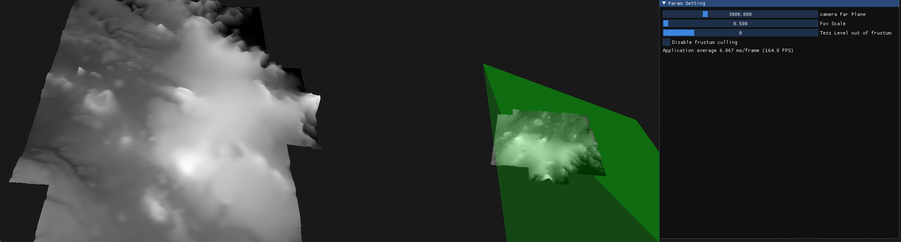

Great article, thank you very much.
I came up with some ideas for optimizing the code.

# frustum culling

## 1. When the camera is rotated, the depth value of the patch changes, causing the tessellation level to change and causing the model to deform, but if the camera is not moving, we should not let the model deform.
- The original code interpolates the tessellation levels based on the depth value.
```glsl
float distance00 = clamp( (abs(eyeSpacePos00.z) - MIN_DISTANCE) / (MAX_DISTANCE-MIN_DISTANCE), 0.0, 1.0 );
```
- Change to interpolation based on the distance from the vertex to the camera, that is, change ```abs(eyeSpacePos00.z)``` to ```length(eyeSpacePos00.xyz)```, as follows
```glsl
float dist00 = length(eyeSpacePos00.xyz);
float distance00 = clamp( (dist00 - MIN_DISTANCE) / (MAX_DISTANCE-MIN_DISTANCE), 0.0, 1.0 );
```

## 2. Outside the view frustum, the patches are still subdivided. This is redundant, because they are not visible to the camera, so the patches outside the view frustum are only subdivided at the lowest level.
Method to determine whether the patch is outside the view frustum: In the view space, calculate the cosine of the angle between the vertex and the z-axis, and compare it with the cosine of the projection angle.
Add the following code to the Tess Control Shader
```glsl
uniform float fovCos;
uniform int outOfFrustumTessLevel = 0;
// ...
// calculate cos of the angle between the camera and -z(0.0, 0.0, -1.0)
float cosAngle00 = dot(normalize(eyeSpacePos00.xyz), vec3(0.0, 0.0, -1.0));
float cosAngle01 = dot(normalize(eyeSpacePos01.xyz), vec3(0.0, 0.0, -1.0));
float cosAngle10 = dot(normalize(eyeSpacePos10.xyz), vec3(0.0, 0.0, -1.0));
float cosAngle11 = dot(normalize(eyeSpacePos11.xyz), vec3(0.0, 0.0, -1.0));

float tessLevel0 = outOfFrustumTessLevel;
float tessLevel1 = outOfFrustumTessLevel;
float tessLevel2 = outOfFrustumTessLevel;
float tessLevel3 = outOfFrustumTessLevel;

if (cosAngle00 >= fovCos ||
     cosAngle01 >= fovCos ||
     cosAngle10 >= fovCos ||
     cosAngle11 >= fovCos)
{
     // Inside the view frustum
}
```
In the cpu program, add the following code
```cpp
int outOfFrustumTessLevel = 0; // When the vertex is outside the view frustum, the tessellation level is 0
float fovScale = 0.75f; // Theoretically it should be 0.5, but during actual testing, it was found that the patches at the edge of the screen will use "outOfFrustumTessLevel" as the tessalation level, so it should be greater than 0.5.
// render loop
// ----------
while (!glfwWindowShouldClose(window))
{
     // ...
     float fov = glm::radians(camera.Zoom);
     float fovCos = glm::cos(fov * fovScale);
     tessHeightMapShader.use();
     tessHeightMapShader.setFloat("fovCos", fovCos);
     tessHeightMapShader.setInt("outOfFrustumTessLevel", outOfFrustumTessLevel);
     // ...
}
```
In order to observe the tessellation effect more clearly, I added two cameras, the left side is the main view and the right side is the bystander view.
 - Disable/Enable frustum culling
https://uploads.disquscdn.com/images/7ae65663cd82570028095ee7df6b3da9c3ee1266813ebeca371db2256b151277.gif 


- Rotate the main view
https://uploads.disquscdn.com/images/9da33e8a8c5f32e9fe40eb0d7e129f55603f11001388afb96e409d0559833e45.gif 


 - Zoom the main view
https://uploads.disquscdn.com/images/5748b7d070c9d080c3c3a9ff740670ff30632058727d747c7944e72f2dc6ea29.gif


- Change the value of outOfFrustumTessLevel
Initially I set the value of outOfFrustumTessLevel to MIN_TESS_LEVEL, which is 4, but found that this was still redundant. When set to 0, the patches outside the view frustum seemed to be completely discarded, which should be the most GPU-saving.
 https://uploads.disquscdn.com/images/164f2991aee219082318686e4da66d83ad16bfea0edf168cd079cdbfc923bcd3.gif 


- Change the value of fovScale
Theoretically it should be 0.5, but during actual testing, it was found that the patches at the edge of the screen will use "outOfFrustumTessLevel" as the tessalation level, so it should be greater than 0.5.
 https://uploads.disquscdn.com/images/61780e3a4975bde38d73ccd55c925430de81dee97719e962c6f0988b820ceb0f.gif 
 