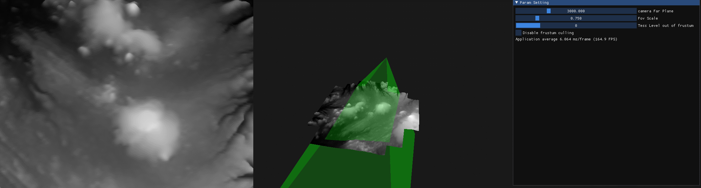
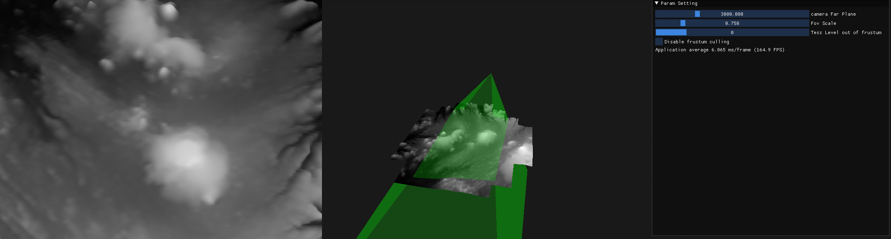
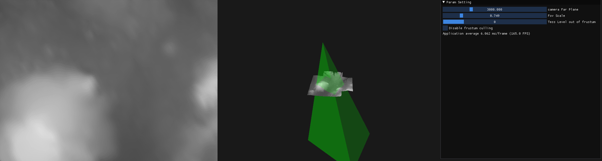
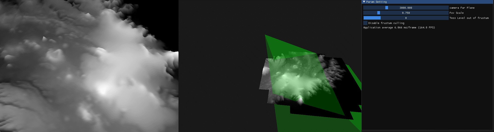

# 视锥剔除

## 1. 在原地旋转视角时，片段的深度值发生变化，导致细分级别变化，导致模型变形，但如果相机没有移动，我们不应该让模型变形。
- 原代码是根据深度值对细分级别进行插值
```glsl
float distance00 = clamp( (abs(eyeSpacePos00.z) - MIN_DISTANCE) / (MAX_DISTANCE-MIN_DISTANCE), 0.0, 1.0 );
```
- 改为根据片段到相机的距离进行插值，即将```abs(eyeSpacePos00.z)```改为。
```glsl
float distance00 = clamp( (abs(eyeSpacePos00.z) - MIN_DISTANCE) / (MAX_DISTANCE-MIN_DISTANCE), 0.0, 1.0 );
```
- 改为根据片段到相机的距离进行插值，即将```abs(eyeSpacePos00.z)```改为```length(eyeSpacePos00.xyz)```，具体如下
```glsl
float dist00 = length(eyeSpacePos00.xyz);
float distance00 = clamp( (dist00 - MIN_DISTANCE) / (MAX_DISTANCE-MIN_DISTANCE), 0.0, 1.0 );
```

## 2. 在视锥之外，依然对片段进行细分，这是多余的，因为视锥之外的片段最终会被裁剪掉，这些片段仅需要做最低级别的细分。
判断定点在视锥之外的方法：在观察空间，计算顶点和z轴的夹角余弦值，与投影角度余弦值进行比较。
在Tess Control Shader中增加如下代码
```glsl
uniform float fovCos;
uniform int outOfFrustumTessLevel = 0;
// ...
// calculate cos of the angle between the camera and -z(0.0, 0.0, -1.0)
float cosAngle00 = dot(normalize(eyeSpacePos00.xyz), vec3(0.0, 0.0, -1.0));
float cosAngle01 = dot(normalize(eyeSpacePos01.xyz), vec3(0.0, 0.0, -1.0));
float cosAngle10 = dot(normalize(eyeSpacePos10.xyz), vec3(0.0, 0.0, -1.0));
float cosAngle11 = dot(normalize(eyeSpacePos11.xyz), vec3(0.0, 0.0, -1.0));

float tessLevel0 = outOfFrustumTessLevel;
float tessLevel1 = outOfFrustumTessLevel;
float tessLevel2 = outOfFrustumTessLevel;
float tessLevel3 = outOfFrustumTessLevel;

if (cosAngle00 >= fovCos ||
    cosAngle01 >= fovCos ||
    cosAngle10 >= fovCos ||
    cosAngle11 >= fovCos)
{
    // 在视锥内部
}
```
在cpu程序中，增加如下代码
```cpp
int outOfFrustumTessLevel = 0; // 顶点在视锥之外时，细分级别为0
float fovScale = 0.75f; // 理论上应该是0.5，但实际测试时，发现屏幕边缘的片段会使用“outOfFrustumTessLevel”作为细分级别，所以这个比例应该詻大于0.5。
// render loop
// -----------
while (!glfwWindowShouldClose(window))
{
    // ...
    float fov = glm::radians(camera.Zoom);
    float fovCos = glm::cos(fov * fovScale);
    tessHeightMapShader.use();
    tessHeightMapShader.setFloat("fovCos", fovCos);
    tessHeightMapShader.setInt("outOfFrustumTessLevel", outOfFrustumTessLevel);
    // ...
}
```

- 关于outOfFrustumTessLevel的值
最初我将outOfFrustumTessLevel的值设为MIN_TESS_LEVEL，即4，但发现这仍然是多余的，设为0时，视锥之外的片段似乎会被完全丢弃，这应该是最节省GPU资源的。
为了更清楚的观察细分效果，我加了两个相机，左边是主视角，右边是旁观者视角。

- 关于fovScale的值
理论上应该是0.5，但实际测试时，发现屏幕边缘会细分变化，所以应该詻大于0.5，所以设为0.75。

为了更清楚的观察细分效果，我加了两个相机，左边是主视角，右边是旁观者视角。
 - 开/关视锥剔除
https://uploads.disquscdn.com/images/7ae65663cd82570028095ee7df6b3da9c3ee1266813ebeca371db2256b151277.gif 


- 旋转相机
https://uploads.disquscdn.com/images/9da33e8a8c5f32e9fe40eb0d7e129f55603f11001388afb96e409d0559833e45.gif 


 - 缩放视锥角度
https://uploads.disquscdn.com/images/5748b7d070c9d080c3c3a9ff740670ff30632058727d747c7944e72f2dc6ea29.gif


- 视锥外细分级别变化
最初我将outOfFrustumTessLevel的值设为MIN_TESS_LEVEL，即4，但发现这仍然是多余的，设为0时，视锥之外的片段似乎会被完全丢弃，这应该是最节省GPU资源的。
 https://uploads.disquscdn.com/images/164f2991aee219082318686e4da66d83ad16bfea0edf168cd079cdbfc923bcd3.gif 


- 视锥角度比例变化
理论上应该是0.5，但实际测试时，发现屏幕边缘的片段会使用“outOfFrustumTessLevel”作为细分级别，所以这个比例应该詻大于0.5。
 https://uploads.disquscdn.com/images/61780e3a4975bde38d73ccd55c925430de81dee97719e962c6f0988b820ceb0f.gif 
 