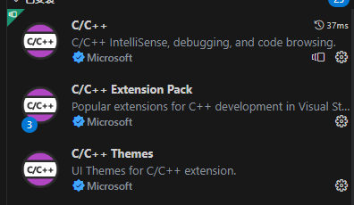
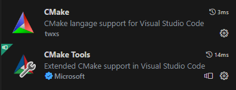

# OpenGL个人学习实践

## 教程参照LearnOpenGL CN

## windows想要运行该实例代码，需要如下准备工作

### 1.下载、安装vcpkg

#### 1.1 下载源码：git https://github.com/microsoft/vcpkg.git
#### 1.2 运行脚本：bootstrap-vcpkg.bat
之后会在脚本目录下生成一个可执行文件vcpkg.exe
#### 1.3 添加环境
将vcpkg.exe所在的路径添加到环境变量Path中；

### 2.安装依赖库

#### 安装glfw3
打开cmd，执行命令```vcpkg install glfw3:x64-windows```
#### 安装glad
打开cmd，vcpkg install glad[gl-api-33]:x64-windows

#### 安装vs编译工具包（编译器、生成器、cmake）

- 最简单的办法是直接安装VS,我这里使用的vs2019；
- 如果不想要复杂的IDE，也可以安装vsbuildTools；

#### 注意：因为安装的依赖库是64位，所以选择的编译器也应该是64位，不能是64_x86，否则cmake配置会报错。

### vscode扩展

